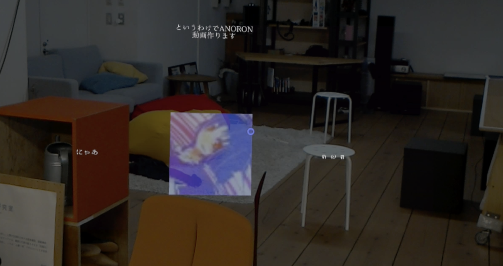
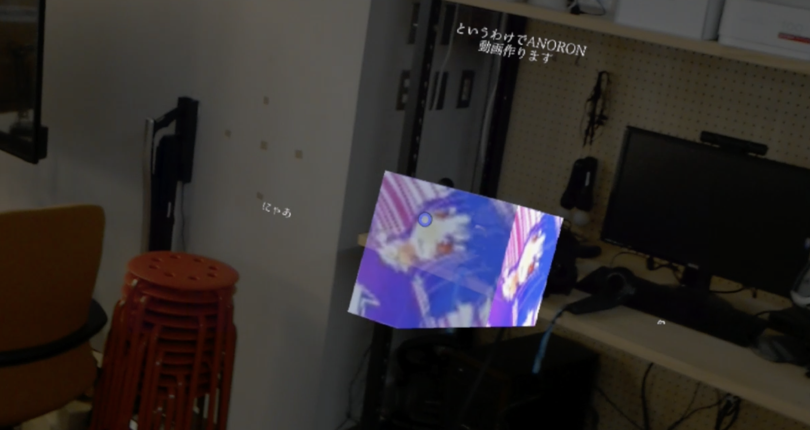

# HoloTweet
研究室居室の空間にTwitterのアカウントを紐付けることで，たとえその人が現実にいなくとも普段はそこにいるのだという存在感を感じさせるシステムのプロトタイプです．



## How To Use
* Unity 2017.4.6f1とHoloLensで動作確認をしました． **現在.NET周りのバグによりHoloLens単体では動かないため，Unity Editor上からHolographic Remoting Playerを用いて動かしてください**．  
* 最初にOAuth認証のためのキーを読み込むクラスを作る必要があります．まずhttps://apps.twitter.com/ にアクセスして自分のTwitterアカウントでログインし，`Create New App`から新しいアプリケーションを作ります．その後`Keys and Access Tokens`タブから，`Consumer Key`,`Consumer Secret`,`Access Token`,`Access Token Secret`を取得してください．
* 次に，Unity Editor側で`TweetHandler.cs`という名前でC#ファイルを新規作成してください．内容は以下のようにしてください．
```C#
public class TweetHandler : MonoBehaviour {
  void Awake () {
    Twity.Oauth.consumerKey       = "Consumer Keyを入れる";
    Twity.Oauth.consumerSecret    = "Consumer Secretを入れる";
    Twity.Oauth.accessToken       = "Access Tokenを入れる";
    Twity.Oauth.accessTokenSecret = "Access Token Secretを入れる";
  }  
}
```
* 起動した後，AirTapまたは"Start"と言うことで，白いキューブがカーソル位置に生成されます．そのキューブをAirTapしてキーボードを表示し，Twitterのアカウント名を入力してください．  
* 入力後EnterをAirTapすると，そのアカウントのアイコン画像と最新のツイート4つが表示されます．  
* あるアカウントの表示をやめたくなった場合は，そのアカウントのアイコン画像にカーソルを合わせて"Finish"と言ってください．
